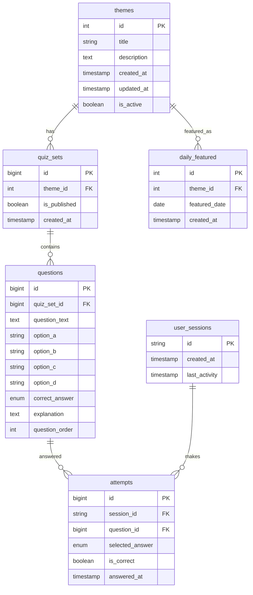

# 設計書

## 概要

QuizBiteは、Next.js（フロントエンド）とGo（バックエンド）を使用したモダンなWebアプリケーションです。ユーザーは手軽に5問のクイズに挑戦し、進捗を追跡してランクアップを目指すことができます。管理者はAIを活用してコンテンツを効率的に作成・管理できます。

## アーキテクチャ

### システム構成

```
┌─────────────────┐    ┌─────────────────┐    ┌─────────────────┐
│   フロントエンド   │    │   バックエンド    │    │   外部サービス    │
│   (Next.js)     │◄──►│     (Go)        │◄──►│  AWS Bedrock    │
│                 │    │                 │    │   (AI生成)      │
└─────────────────┘    └─────────────────┘    └─────────────────┘
                              │
                              ▼
                       ┌─────────────────┐
                       │   データベース    │
                       │    (MySQL)      │
                       └─────────────────┘
```

### 技術スタック

- **フロントエンド**: Next.js 15 + TypeScript + TailwindCSS
- **バックエンド**: Go 1.25 + Echo Framework
- **データベース**: MySQL 8.0
- **AI生成**: AWS Bedrock (Claude)
- **開発環境**: Docker Compose
- **認証**: セッションベース認証（管理者用）

## コンポーネントと インターフェース

### フロントエンドコンポーネント

#### ページコンポーネント
- `HomePage`: メインページ（今日のお題、テーマ一覧）
- `QuizPage`: クイズ実行ページ
- `ResultPage`: 結果表示ページ
- `AdminPage`: 管理者ページ

#### 共通コンポーネント
- `QuizCard`: クイズテーマ表示カード
- `QuestionCard`: 問題表示カード
- `ProgressBar`: 進捗表示バー
- `RankBadge`: ランク表示バッジ
- `ShareButton`: シェアボタン

### バックエンドAPI

#### ユーザー向けAPI
```
GET /themes                  # テーマ一覧取得
GET /themes/featured         # 今日のお題取得
GET /themes/:id/quiz-set     # テーマのクイズセット取得
POST /quiz-sets/submit       # 回答送信
GET /user/stats              # ユーザー統計取得
```

#### 管理者向けAPI
```
POST /admin/login                        # 管理者ログイン
GET /admin/themes                        # テーマ管理一覧
POST /admin/themes                       # テーマ作成
PUT /admin/themes/:id                    # テーマ更新
DELETE /admin/themes/:id                 # テーマ削除
POST /admin/themes/:id/generate-quiz-set # テーマのAI問題生成
POST /admin/featured                     # 注目テーマ設定
PUT /admin/quiz-sets/:id/publish         # クイズセット公開状態切り替え
```

## データモデル

### データベーススキーマ

#### themes テーブル
```sql
CREATE TABLE themes (
    id INT PRIMARY KEY AUTO_INCREMENT,
    title VARCHAR(100) NOT NULL,
    description TEXT,
    created_at TIMESTAMP DEFAULT CURRENT_TIMESTAMP,
    updated_at TIMESTAMP DEFAULT CURRENT_TIMESTAMP ON UPDATE CURRENT_TIMESTAMP,
    is_active BOOLEAN DEFAULT TRUE
);
```

#### quiz_sets テーブル
```sql
CREATE TABLE quiz_sets (
    id BIGINT PRIMARY KEY AUTO_INCREMENT,
    theme_id INT NOT NULL,
    is_published BOOLEAN DEFAULT FALSE,
    created_at TIMESTAMP DEFAULT CURRENT_TIMESTAMP,
    FOREIGN KEY (theme_id) REFERENCES themes(id),
    INDEX idx_theme_id (theme_id),
    INDEX idx_published (is_published)
);
```

#### questions テーブル
```sql
CREATE TABLE questions (
    id BIGINT PRIMARY KEY AUTO_INCREMENT,
    quiz_set_id BIGINT NOT NULL,
    question_text TEXT NOT NULL,
    option_a VARCHAR(200) NOT NULL,
    option_b VARCHAR(200) NOT NULL,
    option_c VARCHAR(200) NOT NULL,
    option_d VARCHAR(200) NOT NULL,
    correct_answer ENUM('A', 'B', 'C', 'D') NOT NULL,
    explanation TEXT,
    question_order INT NOT NULL,
    FOREIGN KEY (quiz_set_id) REFERENCES quiz_sets(id),
    INDEX idx_quiz_set_id (quiz_set_id)
);
```

#### user_sessions テーブル
```sql
CREATE TABLE user_sessions (
    id VARCHAR(36) PRIMARY KEY,
    created_at TIMESTAMP DEFAULT CURRENT_TIMESTAMP,
    last_activity TIMESTAMP DEFAULT CURRENT_TIMESTAMP ON UPDATE CURRENT_TIMESTAMP
);
```

#### attempts テーブル
```sql
CREATE TABLE attempts (
    id BIGINT PRIMARY KEY AUTO_INCREMENT,
    session_id VARCHAR(36) NOT NULL,
    question_id BIGINT NOT NULL,
    selected_answer ENUM('A', 'B', 'C', 'D') NOT NULL,
    is_correct BOOLEAN NOT NULL,
    answered_at TIMESTAMP DEFAULT CURRENT_TIMESTAMP,
    FOREIGN KEY (session_id) REFERENCES user_sessions(id),
    FOREIGN KEY (question_id) REFERENCES questions(id),
    UNIQUE KEY unique_session_question (session_id, question_id),
    INDEX idx_session_id (session_id),
    INDEX idx_question_id (question_id)
);
```

#### daily_featured テーブル
```sql
CREATE TABLE daily_featured (
    id INT PRIMARY KEY AUTO_INCREMENT,
    theme_id INT NOT NULL,
    featured_date DATE NOT NULL,
    created_at TIMESTAMP DEFAULT CURRENT_TIMESTAMP,
    FOREIGN KEY (theme_id) REFERENCES themes(id),
    UNIQUE KEY unique_date (featured_date),
    INDEX idx_featured_date (featured_date)
);
```

#### admin_users テーブル
```sql
CREATE TABLE admin_users (
    id INT PRIMARY KEY AUTO_INCREMENT,
    username VARCHAR(50) UNIQUE NOT NULL,
    password_hash VARCHAR(255) NOT NULL,
    created_at TIMESTAMP DEFAULT CURRENT_TIMESTAMP
);
```

### データ関係図



## エラーハンドリング

### フロントエンドエラーハンドリング

#### エラー種別
- **ネットワークエラー**: 接続失敗、タイムアウト
- **APIエラー**: 4xx、5xx レスポンス
- **バリデーションエラー**: 入力値検証失敗

#### エラー表示戦略
```typescript
interface ErrorState {
  type: 'network' | 'api' | 'validation';
  message: string;
  retryable: boolean;
}

// エラーメッセージの日本語化
const ERROR_MESSAGES = {
  NETWORK_ERROR: 'インターネット接続を確認してください',
  SERVER_ERROR: 'サーバーエラーが発生しました。しばらく待ってから再試行してください',
  NOT_FOUND: 'お探しのコンテンツが見つかりません',
  VALIDATION_ERROR: '入力内容を確認してください'
};
```

### バックエンドエラーハンドリング

#### エラーレスポンス形式
```go
type ErrorResponse struct {
    Error   string `json:"error"`
    Code    string `json:"code"`
    Message string `json:"message"`
}
```

#### エラー種別とHTTPステータス
- **400 Bad Request**: バリデーションエラー
- **401 Unauthorized**: 認証エラー（管理者）
- **404 Not Found**: リソース未発見
- **429 Too Many Requests**: レート制限
- **500 Internal Server Error**: サーバー内部エラー

## テスト戦略

### フロントエンドテスト

#### 単体テスト (Jest + Testing Library)
- コンポーネントの描画テスト
- ユーザーインタラクションテスト
- カスタムフックのテスト

### バックエンドテスト

#### 単体テスト
```go
// テスト例（モックを使用）
func TestQuizService_GetQuizSet(t *testing.T) {
    // モックリポジトリ設定
    mockRepo := &MockQuizRepository{}
    service := NewQuizService(mockRepo)
    
    // テストケース実行
    result, err := service.GetQuizSet(1)
    
    // アサーション
    assert.NoError(t, err)
    assert.NotNil(t, result)
}
```

### データベースクエリ最適化

#### インデックス戦略
- `quiz_sets`: `theme_id`, `is_published` にインデックス
- `questions`: `quiz_set_id` にインデックス
- `attempts`: `session_id`, `question_id` にインデックス
- `daily_featured`: `featured_date` にインデックス

#### クエリ最適化
- N+1問題の回避（JOINまたはバッチ取得）
- 必要なカラムのみ取得
- ページネーション実装

## セキュリティ考慮事項

### 認証・認可
- 管理者のみセッションベース認証
- CSRF トークンによる保護
- パスワードのハッシュ化（bcrypt）

### データ保護
- SQL インジェクション対策（プリペアドステートメント）
- XSS 対策（入力値サニタイズ）
- レート制限による DoS 攻撃対策

### プライバシー
- ユーザー個人情報の最小化
- セッションIDのみでユーザー識別